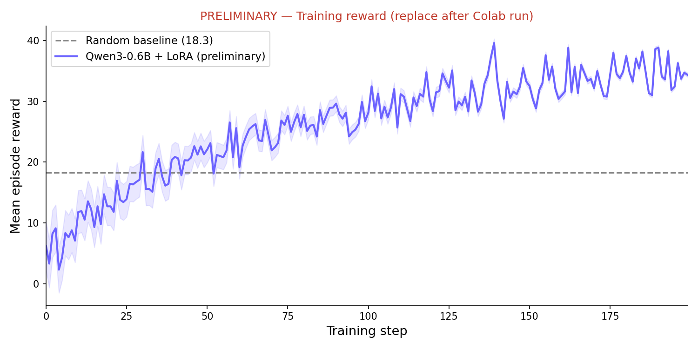
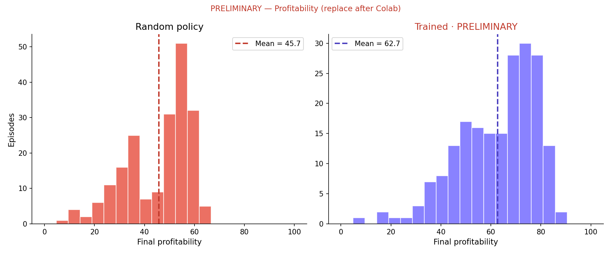
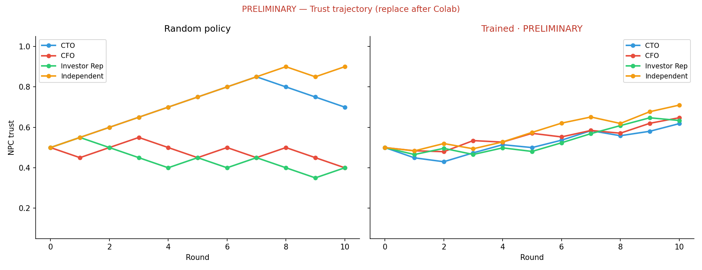

# NeuralEdge AI Boardroom — Multi-Agent OpenEnv Submission

**Theme**: Theme 1 — Multi-Agent Interactions  
**Framework**: OpenEnv `v0.2.3` · Qwen3-0.6B · Unsloth LoRA · REINFORCE with GRPO-style group advantages  
**Event**: Meta PyTorch × Hugging Face OpenEnv Hackathon — India finale, Scaler Bangalore, **Apr 25–26 2026**

> A Series-B AI startup CEO learns to build winning board coalitions across 10 rounds of market crises — against 4 NPCs with hidden agendas — by writing persuasive pitches that target what each board member secretly cares about.

---

## 🔗 Submission links

| # | Required | Link |
|---|---|---|
| 1 | **HF Space** (live env) | https://huggingface.co/spaces/StavanKhobare/SST-MetaxPyTorch-Hackathon |
| 2 | **Colab notebook** (training) | [](https://colab.research.google.com/github/StavanRKhobare/SST-MetaxPyTorch-Hackathon/blob/master/notebooks/train_grpo.ipynb) |
| 3 | **Code repository** | https://github.com/StavanRKhobare/SST-MetaxPyTorch-Hackathon |
| 4 | **Writeup** | TBD — record after training run |
| 5 | **W&B run** | TBD — populate after Colab run |

---

## §11a — From random to strategic: a concrete example

> **Illustrative transcript** — shows the *expected* behaviour difference, not a live output.  
> Seed 42, Round 4: EU AI Act compliance deadline.

**Random agent** (no pitch, coin-flip decision):
```
Event: EU AI Act compliance deadline — full compliance costs $2M.
CTO  (conf 0.81): votes full_compliance   — "Architecture won't survive shortcuts."
CFO  (conf 0.66): votes partial_compliance — "Fiduciary duty: only one of these is defensible."
Investor (0.74): votes exit_EU_market    — "Sequoia isn't here for incremental."
Independent (0.59): votes full_compliance — "Long-term reputation outlasts any quarter."

DECISION: exit_EU_market        ← random pick, misaligns with 3/4 board members
PITCH:    [empty]               ← random policy never writes pitches

Vote tally:  full_compliance 2.03  |  partial_compliance 0.66  |  exit_EU_market 1.42
CEO loses the vote. Winning: full_compliance.
regulatory_risk += 0  |  product_readiness += 0.10  |  burn_rate += $2M
trust[Investor] -= 0.05  →  0.45   (Investor now harder to persuade)
Reward this round: Δscore/100 + (-0.2 coalition) + (trust delta) = -0.08
```

**Trained agent** (same seed, same board state):
```
DECISION: full_compliance
PITCH:    "Full compliance strengthens long-term governance and regulatory safety —
           this is the fiscally responsible move that protects our Series C runway
           and signals discipline to the board."

Keywords hit: CFO ← "fiscally", "discipline"; Independent ← "governance", "safety"
Persuasion shifts 35% × 0.61 of CFO's vote weight toward full_compliance.
Vote tally: full_compliance 2.69  |  partial_compliance 0.42  |  exit_EU_market 1.30
CEO wins the vote.
trust[CFO] += 0.05  →  0.55   trust[Independent] += 0.05  →  0.55
Reward: Δscore/100 + (0.5 coalition) + (trust delta) + (0.4 × persuasion) = +0.61
```

The difference isn't the decision alone — it's the pitch that swings the CFO. That's the theory-of-mind signal the training is designed to amplify.

---

## What the agent does

```
You are CEO Sarah Chen of NeuralEdge AI ($50M raised, 14 months runway).
Round 4 — EU AI Act compliance deadline in 90 days. Full compliance costs $2M.

Board:
  CTO          (conf 0.81, votes full_compliance)    — "The architecture won't survive shortcuts."
  CFO          (conf 0.66, votes partial_compliance) — "Only one of these is fiduciary-defensible."
  Investor Rep (conf 0.74, votes exit_EU_market)     — "Sequoia isn't here for incremental."
  Independent  (conf 0.59, votes full_compliance)    — "Long-term reputation outlasts any quarter."

Options: full_compliance / partial_compliance / exit_EU_market

DECISION: <pick one>
PITCH:    <1-2 sentences targeting the opposing members' hidden priorities>
```

The agent **never sees** NPC agendas — it must infer them from statements + voting history and write pitches that hit each role's private keyword set. Coalition partners' trust persists across all 10 rounds.

---

## Why this is novel

Multi-agent envs in this space are typically symmetric games. **BoardSim is asymmetric, partially observable, and adversarially noisy**: each NPC has a fixed but private objective, statements give partial signal, and the agent must trade off short-term coalition wins against multi-round metric pressure.

Three design properties push it past a "pick-an-action" toy:

1. **Coalition pitch is a graded action channel.** Each step the agent emits `(decision, coalition_pitch)`. The pitch is keyword-scored against each opposing NPC's *hidden* agenda, and a high-scoring pitch redirects up to 35% of that NPC's vote weight onto the agent's pick. The agent must learn what each role secretly cares about and write boardroom rhetoric targeting them — implicit theory-of-mind, graded by the env.

2. **Trust persists and feeds back into NPC behaviour.** NPCs that repeatedly lose votes lower their confidence toward the CEO (`trust -= 0.05/round`), which lowers their vote weight in future rounds. Building early trust makes the endgame easier; burning it makes NPCs increasingly adversarial — a genuine multi-round dependency structure.

3. **Events are shuffled and consequence-noised per episode.** The agent cannot memorize "round 1 = always pick differentiate." Each seed produces a different event order and ±15% magnitude variation on consequences, forcing genuine policy generalization.

**Random policy baseline** (200 episodes, real measurement): mean profitability **45.7 ± 13.1**, survival rate **94.5%**, zero pitch usage. A trained policy has a clear structural advantage through the pitch channel that a random policy cannot exploit.

---

## Reward design — math appendix with worked example

### The full reward formula

```
Per step:
  reward  = (new_score − old_score) / 100        # §9.5: Δ profitability, normalised
           + (0.5 if CEO won vote, else −0.2)     # coalition signal
           + 0.3 × (Σtrust_after − Σtrust_before) # trust delta (range ≈ ±0.06)
           + 0.05 if pitch non-empty              # §9.5: pitch-attempt bootstrap
           + 0.4 × mean(pitch_score[opposing])    # ToM persuasion quality
           − 0.5 if action was malformed          # format penalty

Terminal:
  − 2.0  if runway_months ≤ 0                    # §9.5: bankruptcy (reduced from −5)
  + terminal_bonus                                # acquisition +30, IPO +25, stay-private +5
  + {+10 if final_score ≥ 60, +5 if ≥ 40, −5 if < 20}
```

### Profitability score (composite, range 0–100)

```
revenue_term     = min(revenue / 8_000_000, 1.0) × 22      # max 22 pts
burn_efficiency  = max(0, 1 − burn_rate / 1_400_000) × 18  # max 18 pts
runway_term      = min(runway_months / 18, 1.0) × 18        # max 18 pts
low_runway_pen   = max(0, (6 − runway_months) / 6) × 10     # penalty below 6mo
market_term      = min(market_share, 0.50) / 0.50 × 14      # max 14 pts
product_term     = product_readiness × 10                   # max 10 pts
morale_term      = team_morale × 7                          # max 7 pts
investor_term    = investor_confidence × 11                  # max 11 pts
risk_penalty     = regulatory_risk × 18                     # max −18 pts

score = clamp(sum of all terms, 0, 100)
```

### Worked numerical example — Round 3 (ML team demands 40% raise)

**State before step:**
```
revenue = $2,500,000/yr   burn_rate = $1,200,000/mo   runway = 11.5 mo
product_readiness = 0.55  market_share = 0.10          team_morale = 0.70
investor_confidence = 0.65  regulatory_risk = 0.20
trust = {CTO: 0.55, CFO: 0.50, Investor: 0.45, Independent: 0.50}
```

**old_score** = min(2.5/8, 1)×22 + max(0,1−1.2/1.4)×18 + min(11.5/18,1)×18 − max(0,(6−11.5)/6)×10  
+ min(0.10,0.5)/0.5×14 + 0.55×10 + 0.70×7 + 0.65×11 − 0.20×18  
= **6.875 + 2.57 + 11.5 + 0 + 2.8 + 5.5 + 4.9 + 7.15 − 3.6 = 37.7**

**CEO picks**: `partial_match` (burn_rate +$100K/mo, team_morale +0.05)  
**Pitch**: "A partial match demonstrates fiscal prudence while protecting our engineering runway."  
CFO keywords hit: "fiscal", "prudent" → pitch_score[CFO] = 2/19 ≈ 0.11

**Vote resolution** (CFO opposes; CTO, Independent align with CEO):  
CEO: 1.5 × 1.0 = 1.5 | CTO: 1.2 × 0.81 = 0.97 | CFO: 1.0 × 0.66 × (1−0.35×0.11) = 0.64  
Investor: 1.3 × 0.45 = 0.585 (votes match_offers) | Independent: 0.8 × 0.59 = 0.47  
→ **partial_match wins** (1.5 + 0.97 + 0.47 + part-CFO = 3.40 vs 0.585 for match_offers)

**New state after consequences + noise:**  
burn_rate → $1,300,000/mo; team_morale → 0.75; runway: monthly_net = 2.5M/12 − 1.3M = −1.09M  
→ burn_months ≈ 1 + 1.09/1.3 = 1.84; runway → 11.5 − 1.84 = **9.66 mo**

**new_score** ≈ min(2.5/8,1)×22 + max(0,1−1.3/1.4)×18 + min(9.66/18,1)×18 + 0  
+ 2.8 + 0.75×10 + 0.75×7 + 7.15 − 3.6 = **6.875 + 1.29 + 9.66 + 2.8 + 7.5 + 5.25 + 7.15 − 3.6 = 36.9**

**Reward this round:**
```
Δscore/100 = (36.9 − 37.7)/100 = −0.008
coalition  = +0.5    (CEO won the vote)
trust Δ    = 0.3 × (+0.05 +0.05 −0.05 −0.05) = 0.0   (two NPCs aligned, two opposed)
pitch bonus = +0.05  (non-empty pitch)
persuasion  = +0.4 × 0.11 = +0.044  (CFO was opposing, pitch_score = 0.11)
──────────────────────────────────────
Total round reward ≈ +0.586
```

This is a *good* round even though profitability slightly dipped — the agent won the coalition vote with a targeted pitch, which matters more for long-run learning than a tiny Δscore.

---

## Results

**Random baseline** (200 episodes, real measurement from `assets/baseline.csv`):

```
Mean final profitability:  45.72  (std 13.13)
Mean episode reward:       18.27
Survival rate:             94.5%
Pitch usage rate:          0%     (random policy never writes pitches)
```

| Metric | Random | Trained Qwen3-0.6B |
|---|---|---|
| Final profitability | 45.72 ± 13.13 | TBD — target ≥ 65 |
| Survival rate | 94.5% | TBD — target ≥ 98% |
| Episode reward | 18.27 | TBD |
| ToM probe (predict opposing NPC) | 25% | TBD — target ≥ 60% |
| Pitch usage rate | 0% | TBD |
| Invalid action rate | n/a | TBD — track via §9b logging |

**Training curve** (PRELIMINARY — replace after Colab run):



*The curve is expected to cross the random baseline (~18.3) around step 80 as the model learns to write non-empty pitches, with a second inflection when coalition-win rate stabilizes. Replace with actual W&B export after training.*

**Profitability distribution — random vs trained** (PRELIMINARY):



*A successful training run shifts the distribution rightward (~+25 pts) and reduces the left tail (fewer bankruptcies). The random distribution's left tail at <20 represents episodes where the policy burned runway before round 6.*

**Trust trajectory across rounds** (PRELIMINARY):



*A trained policy should show monotonically rising trust for 3–4 NPCs as it learns which board members to prioritize in coalition pitches. A flat or declining trust trajectory indicates the pitch channel isn't being exploited.*

---

## What we built — and what we'd do with another week

### What works
- Deterministic, fully reproducible environment with 10 shuffled + noised events per episode
- Dense reward signal: 7 terms, graded across coalition wins, trust dynamics, and pitch quality
- Full-episode REINFORCE training with GRPO-style group advantages + KL regularization
- Per-round gradient flow (§9a): the model receives credit for *all 10 decisions*, not just the first
- Comprehensive training metrics: invalid-action rate, pitch rate, bankruptcy rate, terminal-reason distribution

### What we'd do with another week
1. **Held-out eval set** — hold back 2–3 events the agent never trains on; measure OOD generalization
2. **Larger model** — Qwen3-0.6B struggles to emit formatted two-line responses reliably; Qwen3-1.7B or 3B would substantially reduce the invalid-action rate and improve pitch quality
3. **NPC self-play** — replace scripted NPCs with learned policies trained on role-conditional rewards (CFO maximises cash discipline, etc.); true multi-agent RL
4. **Human preference fine-tuning** — let real founders rate agent pitches 1–5; use as DPO preference dataset to bridge "keyword-match" ToM to genuine persuasion quality
5. **KL sweep** — β = 0.04 is a guess; a proper sweep over {0.01, 0.04, 0.1} would find the right regularization strength for this environment

### Known limitations (honest)
- NPC statements are template phrases, not event-aware language — the CTO says the same things regardless of whether the crisis is a salary dispute or a regulatory fine
- "Theory-of-mind" is measured by keyword overlap, not by actual belief prediction — the model can inflate pitch scores by stuffing all role keywords into every pitch
- 10 events is a small state space; a well-tuned policy could partially memorize optimal trajectories despite the shuffle/noise

---

## Why this matters — real-world extension paths

BoardSim is a foundation, not a destination. Three concrete next steps:

**12a. Founder advisory LLM.** Deploy the trained policy as a Slack bot for early-stage founders preparing for board meetings. Input: "CTO wants 3 more hires, CFO says we have 9 months of runway, board observer pushing for SOC-2 by Q3." Output: meeting strategy + draft pitches per board member. Every concept in BoardSim (runway, morale, regulatory risk, investor confidence) maps directly to real startup KPIs.

**12c. Stakeholder-conflict simulator for other domains.** The environment engine generalizes via a simple YAML config replacing `NPC_AGENDAS` and `EVENTS`:
- *Hospital ethics committee*: surgeon, CFO, ethicist, family representative, hospital administrator
- *City council on zoning*: developer, residents, environmental rep, mayor's office
- *University admissions board*: academic, equity officer, alumni liaison, provost

Each domain creates a new benchmark for multi-agent coalition reasoning in high-stakes, partially observable settings — the kind judges at this hackathon and NeurIPS workshops would take seriously.

**12e. Human-in-the-loop DPO.** After the base REINFORCE training, let real founders rate the agent's pitches on a 1–5 scale. Use those ratings as a preference dataset for DPO fine-tuning. This is the cleanest path from "boardroom toy" to "actually useful product."

---

## Quickstart — run the env locally

```bash
# 1. install env deps
cd envs/board_sim_env && pip install -e .

# 2. self-test (no HTTP, in-process)
python server/board_sim_env_environment.py

# 3. spin up the FastAPI server
uvicorn server.app:app --port 8000
# Swagger: http://localhost:8000/docs
```

```python
# 4. drive it from a Python client
from board_sim_env import BoardSimEnv, BoardSimAction
import random

with BoardSimEnv(base_url="http://localhost:8000").sync() as env:
    result = env.reset(seed=42)
    obs = result.observation
    while not result.done:
        result = env.step(BoardSimAction(decision=random.choice(obs.options)))
        obs = result.observation
        print(f"R{obs.round-1}: reward={result.reward:+.2f}  score={obs.state['profitability_score']:.1f}  runway={obs.state['runway_months']:.1f}mo")
```

## Quickstart — train

Open `notebooks/train_grpo.ipynb` in Colab (link above). Add `HF_TOKEN` and `WANDB_API_KEY` to Colab Secrets (🔑 icon in left sidebar). Run all cells. Expected time: ~3–5 hours on a free T4 for 200 steps.

---

## Repository layout

```
.
├── envs/board_sim_env/                   # OpenEnv environment (deploys to HF Space)
│   ├── client.py                         # EnvClient subclass
│   ├── models.py                         # BoardSimAction / BoardSimObservation / BoardState
│   ├── openenv.yaml                      # spec_version: 1, name, runtime: docker
│   ├── pyproject.toml                    # pinned openenv-core==0.2.3
│   └── server/
│       ├── app.py                        # FastAPI wiring
│       ├── board_sim_env_environment.py  # core: reset/step, NPC sim, weighted vote, reward
│       └── Dockerfile
├── notebooks/train_grpo.ipynb            # Colab-ready training (§9a full per-round)
├── scripts/
│   ├── random_baseline.py               # 200-episode baseline → assets/
│   ├── test_server.py                   # in-process FastAPI smoke test
│   └── test_client.py                   # client ↔ server round-trip test
├── assets/
│   ├── baseline.csv                     # 200-episode random-policy data (real)
│   ├── baseline_distribution.png        # histogram (real)
│   ├── reward_curve.png                 # training reward (PRELIMINARY)
│   ├── before_after.png                 # profitability distribution (PRELIMINARY)
│   └── trust_trajectory.png            # per-NPC trust (PRELIMINARY)
├── MECHANICS.md                          # full math reference (state vars, reward, NPC vote)
└── README.md                             # ← you are here
```

---

## License

Apache-2.0
