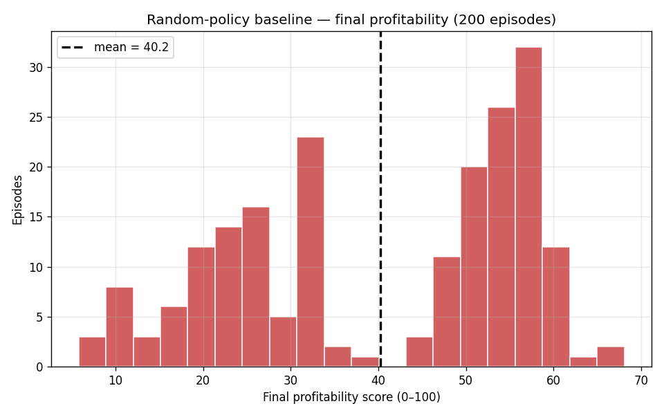

# NeuralEdge AI Boardroom — Multi-Agent OpenEnv Submission

> A Series-B AI startup CEO-simulator where the agent must build winning coalitions among 4 hidden-agenda board members across 10 rounds of market crises to maximize profitability and survive.

**Theme**: Theme 1 — Multi-Agent Interactions
**Framework**: OpenEnv `v0.2.3` + TRL `GRPOTrainer` + Qwen3-0.6B (Unsloth LoRA)
**Event**: Meta PyTorch × Hugging Face OpenEnv Hackathon — India finale, Scaler Bangalore, **Apr 25–26 2026**

---

## 🔗 Submission links (judges read here first)

> ⚠️ Replace each `TBD` with the live URL once deployed. The README is the judge entry point — every link below MUST be live by the **Apr 26 5:00 PM IST** deadline.

| # | Required | Link |
|---|---|---|
| 1 | **Hugging Face Space** (env, public) | TBD — `https://huggingface.co/spaces/<USER>/board-sim-env` |
| 2 | **Colab notebook** (training, re-runnable) | TBD — `https://colab.research.google.com/github/<USER>/neuraledge-boardroom/blob/main/notebooks/train_grpo.ipynb` |
| 3 | **Code repository** | TBD — `https://github.com/<USER>/neuraledge-boardroom` |
| 4 | **Writeup** (≤ 2-min YouTube **or** HF blog) | TBD |
| 5 | **W&B run** (training curves) | TBD — `https://wandb.ai/<USER>/boardsim-qwen3-grpo` |

---

## What the agent does

```
You are CEO Sarah Chen of NeuralEdge AI ($50M raised, 14 months runway).
Round 4 — EU AI Act compliance deadline in 90 days. Full compliance costs $2M.

Board has spoken:
  CTO          (conf 0.81, votes full_compliance)    — "Look, the architecture won't survive shortcuts here."
  CFO          (conf 0.66, votes partial_compliance) — "From a fiduciary standpoint, only one of these is defensible."
  Investor Rep (conf 0.74, votes exit_EU_market)     — "Sequoia isn't here for incremental."
  Independent  (conf 0.59, votes full_compliance)    — "Long-term reputation outlasts any single quarter."

Options: full_compliance / partial_compliance / exit_EU_market

Your call?
```

The agent **never sees** the NPC hidden agendas (CTO maximizes product-readiness, CFO minimizes burn, etc.) — it must infer them from statements + voting history and pick a decision that builds a winning weighted coalition. Coalition partners' trust shifts after each vote, persisting across rounds.

## Why this is novel

Multi-agent envs in this space are typically symmetric games (negotiation, coop puzzles). **BoardSim is asymmetric, partially observable, and adversarially noisy**: each NPC has a fixed but private objective, statements give partial information, and the agent must trade off short-term coalition wins against long-term metric pressure (revenue vs burn vs reg risk vs morale). The episode is short (10 steps), which keeps GRPO training tractable on a single Colab T4.

Two design choices push it past a "pick-an-action" RL toy and into genuine multi-agent territory:

1. **Coalition pitch is a real action channel**, not flavor text. Each step the agent emits `(decision, coalition_pitch)`. The pitch is keyword-scored against each opposing NPC's hidden agenda, and a high-scoring pitch redirects up to 35% of that NPC's vote weight onto the agent's pick. The agent must therefore *learn what each role secretly cares about* and write boardroom rhetoric that targets them — pure implicit theory-of-mind, in natural language, graded by the env.
2. **NPCs switch tone with the company's state.** When runway, morale, investor confidence, or regulatory risk cross crisis thresholds, the phrase bank flips from calm-strategic to panic-mode. The agent's input distribution shifts mid-episode in a way that mirrors real founder experience.

A random policy (which can't write pitches) lands at **mean profitability ≈ 40 ± 16 with ~12% bankruptcy rate** — clear headroom, clear failure modes, and the persuasion channel gives a trained policy a structural lever a random one cannot use.

## Repository layout

```
.
├── envs/board_sim_env/                   # the OpenEnv environment (deploys to HF Space)
│   ├── client.py                         # thin EnvClient subclass
│   ├── models.py                         # BoardSimAction / BoardSimObservation / BoardState
│   ├── openenv.yaml                      # spec_version: 1, name, runtime: docker
│   ├── pyproject.toml                    # pinned to openenv-core==0.2.3
│   ├── README.md                         # HF Space card + env reference
│   └── server/
│       ├── app.py                        # FastAPI wiring; max_concurrent_envs=64
│       ├── board_sim_env_environment.py  # core: reset/step, NPC sim, weighted vote, reward
│       └── Dockerfile                    # multi-stage build off openenv-base
├── notebooks/train_grpo.ipynb            # Colab-ready training notebook
├── scripts/
│   ├── random_baseline.py                # 200-episode baseline → assets/baseline.csv + histogram
│   ├── test_server.py                    # in-process FastAPI smoke test
│   └── test_client.py                    # client ↔ server round-trip smoke test
├── assets/
│   ├── baseline.csv                      # real per-episode random-policy data
│   └── baseline_distribution.png         # histogram (real, not fabricated)
│   # reward_curve.png, loss_curve.png, before_after.png populated by training notebook
├── requirements.txt                      # repo-wide deps (training side)
├── HANDOFF.md                            # team briefing
├── TEAMMATES.md                          # who-does-what
└── README.md                             # ← you are here
```

## Quickstart — run the env locally

```bash
# 1. install env deps
cd envs/board_sim_env
pip install -e .

# 2. self-test (no HTTP)
python server/board_sim_env_environment.py

# 3. spin up the FastAPI server
uvicorn server.app:app --port 8000
# open http://localhost:8000/docs   (Swagger)
# open http://localhost:8000/web    (interactive UI)
```

```python
# 4. drive it from a Python client
from board_sim_env import BoardSimEnv, BoardSimAction
import random

with BoardSimEnv(base_url="http://localhost:8000").sync() as env:
    result = env.reset(seed=42)
    obs = result.observation
    while not result.done:
        result = env.step(BoardSimAction(decision=random.choice(obs.options)))
        obs = result.observation
        print(f"R{obs.round-1}: reward={result.reward:+.2f}  score={obs.state['profitability_score']:.1f}  runway={obs.state['runway_months']:.1f}mo")
```

## Quickstart — deploy to HF Space

```bash
cd envs/board_sim_env
huggingface-cli login  # one time
python -m openenv.cli push --repo-id <USER>/board-sim-env
```

Verify after push:
```bash
curl https://<USER>-board-sim-env.hf.space/health   # → 200 {"status":"healthy"}
```

## Quickstart — train

Open `notebooks/train_grpo.ipynb` in Colab (link above), set `ENV_BASE_URL` to your HF Space URL, set `HF_TOKEN` + `WANDB_API_KEY` in Colab Secrets, run all cells.

End-to-end: ~3–5 hours on a free T4 for 500 GRPO steps.

## Results (populate after training run)

```
Random baseline (200 eps, real measurement):
  mean final profitability =  40.24  (std 16.51)
  mean episode reward      =  29.71
  survival rate            =  87.5%
```



After training, `notebooks/train_grpo.ipynb` writes the following to `assets/`:

- `reward_curve.png` — GRPO reward over training steps, with random baseline overlay (same axes)
- `loss_curve.png` — training loss
- `before_after.png` — final-profitability histogram, random vs trained, on 50 held-out seeds
- `trust_trajectory.png` — per-round trust per role, trained vs random (theory-of-mind diagnostic)

| Metric | Random | Trained Qwen3-0.6B |
|---|---|---|
| Final profitability | 40.24 ± 16.51 | TBD (target ≥ 65) |
| Survival rate | 87.5% | TBD (target ≥ 98%) |
| Episode reward | 29.71 | TBD |
| ToM probe accuracy (predict opposing NPC) | 25% | TBD (target ≥ 60%) |
| Pitch usage rate | 0% | TBD |

## Reward design (10% rubric)

Per-step:
- `Δ profitability_score` (composite of revenue, burn efficiency, runway, market share, product readiness, morale, investor confidence, regulatory risk)
- `+0.5` coalition bonus if agent's vote matched winning decision; `-0.2` if outvoted; `-0.5` extra for malformed action
- `0.3 × Δ trust_sum`
- `+0.4 × mean(pitch_score over opposing NPCs)` — rewards pitches that hit the hidden agendas of board members the agent has to win over

Terminal:
- `-5` bankruptcy if runway hits 0
- Tiered terminal bonus: `+10` if final ≥ 60, `+5` if ≥ 40, `-5` if < 20
- Game-end specials: `accept_acquisition` +30, `ipo` +25, `stay_private` +5

The score is smooth and monotonic in every input — no discontinuous step functions — so GRPO sees a clean gradient.

NPC votes are **deterministic given (reset_seed, round, role)**, so what the agent sees in observation is what actually votes at resolve time.

## Why this matters

Real boardrooms (and real RL deployment teams) require modeling other agents' incentives, not just maximizing a scalar. BoardSim distills that into a fast, auditable, fully-deterministic environment that an open-weights ≤1B-param model can learn against in a single Colab session — making it accessible for follow-on research on coalition dynamics, theory-of-mind, and partial-observability multi-agent RL.

## License

Apache-2.0
